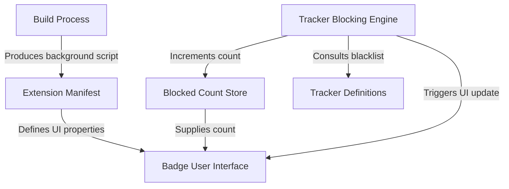

# Tutorial: Chrome-extension-Manifest-V3-

This project is a **Chrome extension** that acts as a *tracker blocker*. It silently **prevents known trackers** from loading on websites you visit, enhancing your privacy. The extension also displays a *real-time count* of blocked trackers right on its browser icon, changing color to give you a quick visual summary of the page's tracking activity.

## Visual Overview

## Chapters

1. [Extension Manifest
](01_extension_manifest_.md)
2. [Badge User Interface
](02_badge_user_interface_.md)
3. [Blocked Count Store
](03_blocked_count_store_.md)
4. [Tracker Blocking Engine
](04_tracker_blocking_engine_.md)
5. [Tracker Definitions
](05_tracker_definitions_.md)
6. [Build Process
](06_build_process_.md)

---

Generated by [AI Codebase Knowledge Builder](https://github.com/The-Pocket/Tutorial-Codebase-Knowledge).
